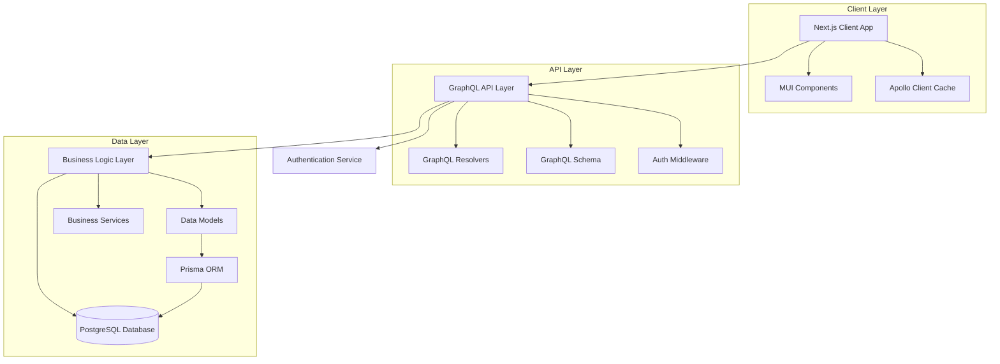

# Design Document

## Overview

The Animal Shelter Management System is a full-stack web application built with Next.js 14, featuring a GraphQL API with Apollo Server, PostgreSQL database, and Material-UI components. The system follows a modular architecture with clear separation of concerns, implementing role-based access control and secure data management practices.

## Architecture

### High-Level Architecture



### Technology Stack

- **Frontend**: Next.js 14 (App Router), React 18, Material-UI v5, Apollo Client
- **Backend**: Next.js API Routes, Apollo Server, GraphQL
- **Database**: PostgreSQL with Prisma ORM
- **Authentication**: NextAuth.js with JWT tokens
- **File Storage**: AWS S3 or local storage for animal photos
- **Deployment**: Vercel or Docker containers

## Components and Interfaces

### Core Domain Models

#### Animal Entity
```typescript
interface Animal {
  id: string
  name: string
  species: Species
  breed: string
  age: number
  gender: Gender
  intakeDate: Date
  status: AnimalStatus
  medicalRecords: MedicalRecord[]
  photos: Photo[]
  behaviorNotes: string
  specialNeeds: string[]
  adoptionFee: number
  microchipId?: string
}
```

#### Volunteer Entity
```typescript
interface Volunteer {
  id: string
  userId: string
  contactInfo: ContactInfo
  availability: Availability[]
  skills: Skill[]
  certifications: Certification[]
  hoursLogged: VolunteerHour[]
  assignments: Assignment[]
  emergencyContact: ContactInfo
}
```

#### Adoption Entity
```typescript
interface Adoption {
  id: string
  animalId: string
  adopterId: string
  applicationDate: Date
  approvalDate?: Date
  completionDate?: Date
  status: AdoptionStatus
  adoptionFee: number
  paymentStatus: PaymentStatus
  notes: string
  followUpScheduled?: Date
}
```

### GraphQL Schema Structure

#### Queries
- `animals(filters: AnimalFilters, pagination: PaginationInput): AnimalConnection`
- `volunteers(filters: VolunteerFilters): [Volunteer]`
- `adoptions(filters: AdoptionFilters): [Adoption]`
- `reports(type: ReportType, dateRange: DateRange): Report`

#### Mutations
- `createAnimal(input: CreateAnimalInput): Animal`
- `updateAnimal(id: ID!, input: UpdateAnimalInput): Animal`
- `createAdoptionApplication(input: AdoptionApplicationInput): Adoption`
- `approveAdoption(id: ID!, notes: String): Adoption`
- `logVolunteerHours(input: VolunteerHoursInput): VolunteerHour`

### Frontend Component Architecture

#### Page Components
- `/dashboard` - Role-based dashboard with key metrics
- `/animals` - Animal listing and management
- `/animals/[id]` - Individual animal profile
- `/volunteers` - Volunteer management (staff only)
- `/adoptions` - Adoption process management
- `/reports` - Analytics and reporting

#### Shared Components
- `AnimalCard` - Display animal summary information
- `AdoptionForm` - Multi-step adoption application
- `VolunteerScheduler` - Calendar-based scheduling
- `ReportGenerator` - Configurable report builder
- `RoleGuard` - Component-level access control

## Data Models

### Database Schema Design

#### Core Tables
- `users` - Authentication and basic user info
- `animals` - Animal records and status
- `volunteers` - Volunteer-specific information
- `adoptions` - Adoption applications and processes
- `medical_records` - Animal medical history
- `volunteer_hours` - Time tracking for volunteers
- `inventory` - Resource and supply management

#### Relationships
- One-to-Many: Animal → MedicalRecords
- One-to-Many: Volunteer → VolunteerHours
- One-to-One: Adoption → Animal (during adoption process)
- Many-to-Many: Volunteers ↔ Skills (through junction table)

### Role-Based Access Control

#### Role Definitions
- **Admin**: Full system access, user management, system configuration
- **Staff**: Animal management, adoption processing, volunteer coordination
- **Volunteer**: Limited animal viewing, hour logging, assigned task access
- **Adopter**: Application submission, adoption status viewing

#### Permission Matrix
```typescript
const permissions = {
  ADMIN: ['*'], // All permissions
  STAFF: [
    'animals:read', 'animals:write', 'animals:delete',
    'adoptions:read', 'adoptions:write', 'adoptions:approve',
    'volunteers:read', 'volunteers:assign',
    'reports:generate'
  ],
  VOLUNTEER: [
    'animals:read:basic',
    'hours:log',
    'assignments:view',
    'profile:update'
  ],
  ADOPTER: [
    'animals:read:public',
    'adoptions:create',
    'adoptions:read:own'
  ]
}
```

## Error Handling

### GraphQL Error Strategy
- **Validation Errors**: Return user-friendly messages with field-specific details
- **Authorization Errors**: Generic "Access denied" messages to prevent information leakage
- **System Errors**: Log detailed errors server-side, return generic client messages
- **Network Errors**: Implement retry logic with exponential backoff

### Client-Side Error Handling
- Global error boundary for unhandled React errors
- Apollo Client error link for GraphQL error processing
- Toast notifications for user-facing errors
- Offline detection and queue management for critical operations

### Error Logging and Monitoring
- Structured logging with correlation IDs
- Error aggregation and alerting
- Performance monitoring for GraphQL operations
- User action tracking for debugging

## Testing Strategy

### Unit Testing
- **Backend**: Jest for resolver logic, service layer, and utility functions
- **Frontend**: React Testing Library for component behavior
- **Database**: Test database with seed data for integration tests

### Integration Testing
- GraphQL schema and resolver integration
- Authentication flow testing
- Database transaction testing
- File upload and storage testing

### End-to-End Testing
- Playwright for critical user journeys
- Role-based access testing
- Adoption process workflow testing
- Mobile responsiveness testing

### Performance Testing
- GraphQL query performance benchmarking
- Database query optimization validation
- Frontend bundle size monitoring
- API rate limiting verification

## Security Considerations

### Authentication & Authorization
- JWT tokens with short expiration and refresh mechanism
- Role-based middleware for GraphQL resolvers
- Session management with secure cookie handling
- Password hashing with bcrypt

### Data Protection
- Input validation and sanitization
- SQL injection prevention through Prisma ORM
- XSS protection with Content Security Policy
- HTTPS enforcement in production

### API Security
- Rate limiting per user and IP
- Query complexity analysis to prevent DoS
- Audit logging for sensitive operations
- CORS configuration for allowed origins

## Deployment Architecture

### Development Environment
- Local PostgreSQL database
- Next.js development server
- Hot reloading for rapid development
- Mock data seeding for testing

### Production Environment
- Containerized deployment with Docker
- PostgreSQL with connection pooling
- CDN for static assets and images
- Environment-based configuration management
- Automated database migrations
- Health checks and monitoring endpoints